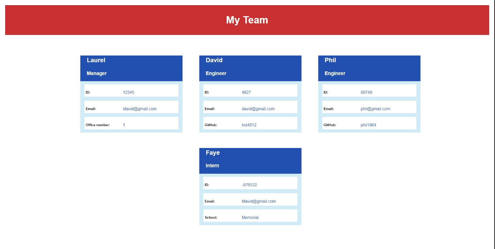

# Title

TEAM PROFILE GENERATOR

## Description

Use Inquirer Prompt to ask a user to answer a series of questions using the CLI.  The series of questions is set up for the user, as manager, to enter manager specifici properties aftr which the manager is then prompted to add additional employees to the team, either engineers or interns, or to exit the process.  Once exited, responses from the inquirer process are exported to template which creates profile cards for each team member featuring the reponses provided through the inquirer interface.

Output is based on the acceptance criteria outlined in the Module 10 Assignment Overview [Module-10-assignment](https://courses.bootcampspot.com/courses/1181/assignments/23350?module_item_id=463364).

A sample display of expected output is included in the Challenge outline.

## Table of Contents

* [Installation](#installation)
* [Usage](#usage)
* [License](#license)
* [Testing](#testing)
* [Credits](#credits)
* [Questions](#questions)

## Installation

The process is initiated by running node app.js in the CLI to bring up the series of questions that the manager must answer in order to generate the team profile.  

## Usage

Allows quick access to employee data such as name, position, id#, email address and, depending on the employee role, office phone number (manager), GitHub username (engineer) or school attended (intern).

## License

This application is covered under the MIT license.  [MIT license link](https://choosealicense.com/licenses/mit/)

## Contributing

Please visit [Contributor Covenant website](https://contributor-covenant.org) for guidance or reach out directly using the contact informtion below.

## Testing

None at this time.

## Credits

Significant assistance was provided in my weekly tutoring session, along with additional assistance from the TA's during office hours and a number of visits to the Stack Overflow website [https://stackoverflow.com](https://stackoverflow.com).

## Questions?

If you have any questions, please see my contact details below:

## GitHub Username

My GitHub Username is [github.com/lnd4812](https://github.com/lnd4812)

## GitHub Repository

My GitHub repository link for this project is [github.com/lnd4812/team-profile-generator](https://github.com/lnd4812/team-profile-generator)

## Application Video Link

The link to the application video may be accessed at the following links:

Vidline - Videos
[Part 1 -TDD](https://www.vidline.com/share/V0X9NH5N8G/e60a8af90ef07047f1d2e167b20916b5)
[Part 1b - TDD.Employee](https://www.vidline.com/share/V0XJBHE2G3/7e2896c1bcd0b4fe2319a5475b5b4ced)

Vidline - Videos
[Part 2 - Inquirer Prompt run through & team profile creation](https://www.vidline.com/share/V07EVHVOMR/3e88f10c338b25ffa795913279197d35).

## Contact information

To contact me directly, please feel free to drop me an e-mail at: <a hef="mailto:laureldavid64@gmail.com">laureldavid64@gmail.com</a>
